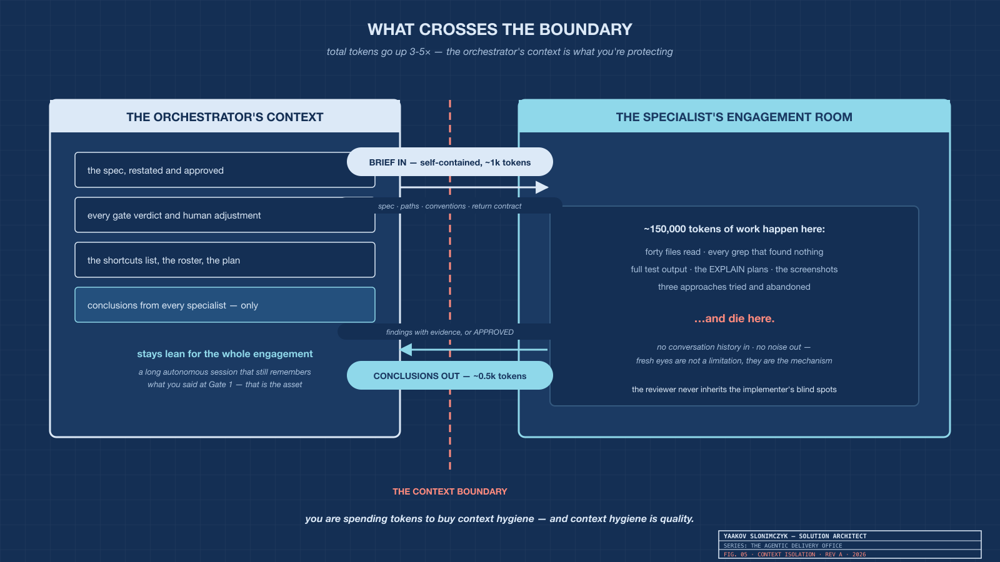
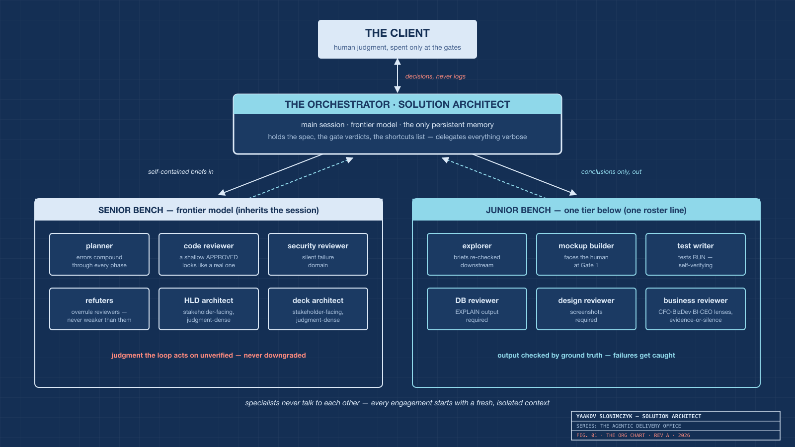
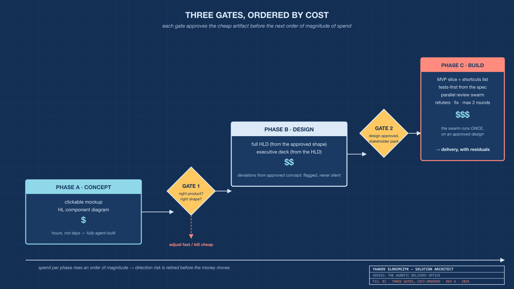
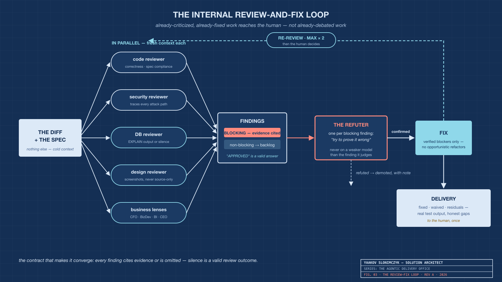
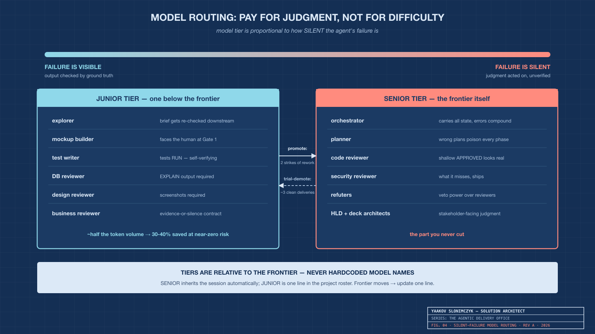
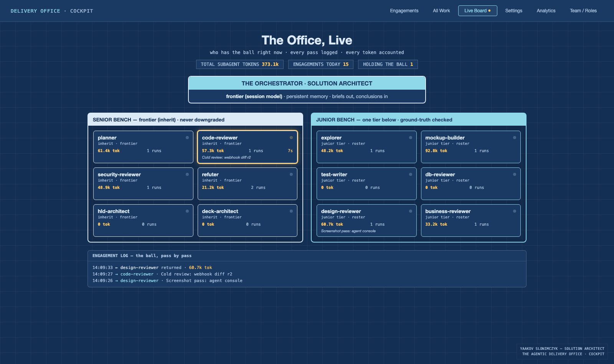
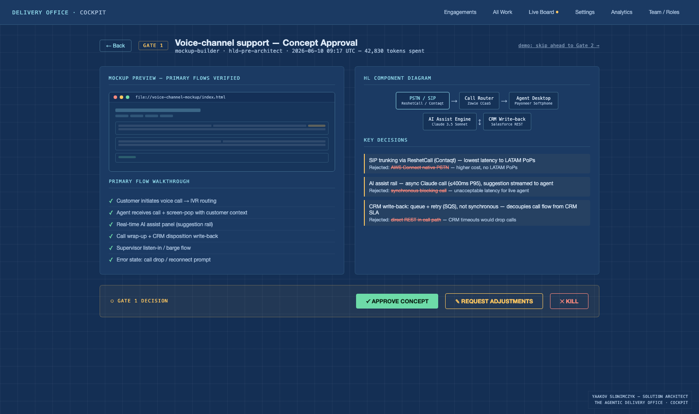
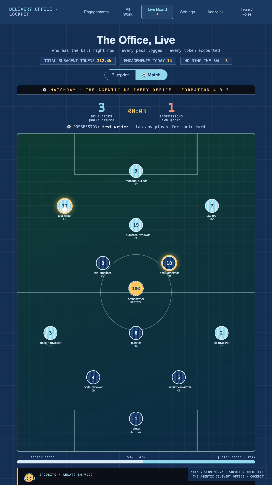
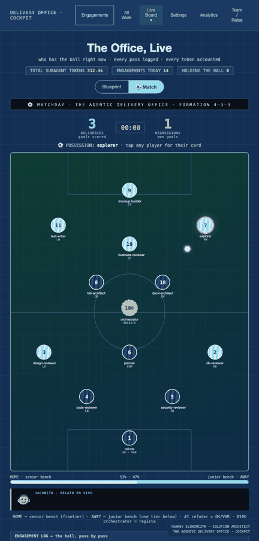

# The Agentic Delivery Office

## How I run AI sub-agents like a consulting firm — and why the org chart matters more than the prompts

*By Yaakov Slonimczyk — Solution Architect*

---

I've spent twenty-plus years as a solution architect, which means I've spent twenty-plus years watching the same truth reassert itself in every technology cycle: **structure beats talent**. A mediocre team with clear roles, honest reviews, and staged approvals ships; a brilliant team without them debates.

When I started orchestrating AI coding agents seriously, I made the mistake everyone makes first: I treated the model as a very fast developer and myself as a very patient reviewer. It worked — the way reviewing every line of a junior's output "works." The bottleneck was me.

So I did what an architect does: I stopped prompting and started **staffing**. The result is a methodology I now install in every project — a portable kit of agent definitions, a delivery protocol, and mechanical quality gates. This article is the executive summary: five principles, five drawings — and at the end, the cockpit where it all becomes something you can watch.

---

## 1. The boundary is the product

Everything in this methodology rests on one mechanism: a sub-agent gets a **completely fresh context window**. It doesn't see my conversation. It receives a self-contained brief — spec, paths, conventions, a contract for what to return — and it sends back conclusions. Everything in between, dies with it.



*Fig. 05 — The context boundary: a 1k-token brief goes in; 0.5k tokens of conclusions come out; 150k tokens of exploration die inside.*

Most people read this as a cost feature: the specialist can burn 150,000 tokens reading files and running tests, and the orchestrator only pays for the summary. True, but secondary. The real product is **judgment quality**: a reviewer who never saw the implementer's reasoning cannot inherit the implementer's blind spots. We separate authors from reviewers in human organizations for exactly this reason. Fresh eyes are not a limitation of the architecture. They are the mechanism.

The corollary: total tokens go *up* — a full delivery cycle runs 3–5× the tokens of a single-agent session. What you're buying is context hygiene in the one context that must survive the whole engagement. Which brings us to the org chart.

## 2. One persistent mind, two benches



*Fig. 01 — The Agentic Delivery Office: client, orchestrator, and two benches of specialists who never talk to each other.*

The **orchestrator** — the main session — is the solution architect of the operation, and structurally it cannot be anything else: sub-agents can't spawn sub-agents, can't pause for human input, and remember nothing between invocations. The main session is the only entity that persists across the whole engagement, so it holds what matters: the spec, every verdict I've given, the list of shortcuts taken. It delegates everything verbose and presents me **decisions, never logs**.

The specialists split into two benches, and the split is the first thing most people get wrong. My early roster looked like a company org chart: CEO agent, CFO agent, BizDev agent. Delete that instinct. **An agent earns its seat through two things only: distinct tool access and a verifiable deliverable.** A "CFO agent" with no spreadsheet and no pricing data is the same model wearing a hat — you pay spawn overhead to receive opinions.

The business lenses survive, but transformed: one grounded *business-reviewer* invoked once per lens — CFO, BizDev, BI, CEO — under a hard rule: **every finding cites a number it computed, data it fetched, or a document it can quote — or the finding is omitted.** The CFO lens reads the actual infra config and fetches actual provider pricing. Eloquence without evidence doesn't get a seat.

## 3. Gates ordered by cost: retire direction risk before the money moves



*Fig. 02 — Concept ($) → Gate 1 → Design ($$) → Gate 2 → Build ($$$). Each gate approves the cheap artifact before the next order of magnitude of spend.*

Validation artifacts have wildly different costs. A clickable mockup plus a component diagram costs a fraction of a full High-Level Design; an HLD costs a fraction of a hardened build. So the protocol stages them:

**Phase A — Concept.** An explorer maps the codebase; a mockup-builder produces a clickable HTML prototype of the primary flows (static, no backend, real labels — verified clickable before it reaches me); the planner draws the component diagram. **Gate 1, the only question that matters: right product, right shape?** Judging a running mockup takes minutes — plans hide what demos reveal.

**Phase B — Design.** Only after Gate 1 do the expensive design artifacts get produced: the full HLD elaborating the approved shape (with a mandatory *"deviations from approved concept"* section — agents don't get to silently redesign what I approved), then the executive deck derived from the finished HLD, numbers reconciled. **Gate 2 approves the design and hands me a stakeholder-ready package as a by-product.**

**Phase C — Build & Harden.** Tests written from the spec — never from the implementation, so they can't rationalize its bugs. Implementation with every deliberate shortcut tracked on a list the hardening phase must resolve. Then the review swarm.

Each human gate spends pennies of my attention before the next order of magnitude of agent spend. Direction errors — the expensive kind — die at the mockup, for the price of a demo.

## 4. The loop that converges: critics, refuters, and a hard cap



*Fig. 03 — Parallel lens reviews → refuters kill weak findings → fix verified blockers → max two rounds → deliver with residuals.*

Here's the failure mode nobody warns you about in autonomous review loops: **an LLM asked to review will always find something.** In a human workflow, weak feedback gets filtered by you. In an autonomous fix loop, every plausible-but-wrong finding triggers rework — and two unbounded critics will oscillate forever, each "fix" triggering the other's next objection.

Three rules make the loop converge:

1. **The verdict contract.** Every reviewer tags findings BLOCKING or NON-BLOCKING, cites evidence it personally verified, and — critically — is told that returning `APPROVED` is a fully acceptable outcome. Silence is a valid answer. This single sentence is the most portable quality mechanism in the whole system.
2. **The refuter.** Every blocking finding gets an adversary whose only job is to prove it wrong. Hallucinated objections die before causing rework. Nearly pure token cost, nearly pure precision gain.
3. **The hard cap.** Two fix rounds, then escalate to the human. A loop that can't converge shouldn't pretend to.

What reaches me is already-criticized, already-fixed work — with the residual findings listed honestly as my backlog, not smoothed over.

## 5. Pay for judgment, not for difficulty



*Fig. 04 — Route by failure visibility: grounded agents run a tier below; judging agents run the frontier. Tiers are relative — never hardcoded.*

Token optimization is where most multi-agent setups quietly destroy themselves, because the intuitive rule — put cheap models on easy tasks — is wrong. The correct routing criterion:

> **Model tier should be proportional to how *silent* the agent's failure is — not how hard its task is.**

The test-writer can run a junior model: its tests *run* — failures are caught mechanically. The mockup-builder faces me at Gate 1 — failures are visible. The DB reviewer must attach `EXPLAIN` output — claims are grounded. But the code reviewer? A shallow `APPROVED` from a weak model is *indistinguishable* from a real one. That's the most expensive token saving in the system. The judging tier — planner, code and security reviewers, and above all the refuters, who hold veto power — runs the frontier, always. A refuter must never be weaker than the finding it judges; otherwise the cheap model overrules the smart one.

Two operational rules complete it. **Tiers are relative to the frontier, never hardcoded** — the frontier moves every few months; senior agents inherit the session model automatically, and the junior tier is one line in the project roster. And **assignments evolve like personnel**: an agent whose junior-tier output causes rework twice gets promoted; a senior whose findings are never challenged across three deliveries gets a trial demotion — every move logged with a date and a reason, like the personnel file it is. In practice the junior bench carries about half the token volume, so the routing cuts 30–40% of spend without touching the part you never cut.

---

## The cockpit: you can't delegate what you can't see

Every conversation about this methodology ends at the same question: *"Fine — but how do you watch it work?"* Fair. Minimal intervention without visibility isn't delegation; it's abdication. So the office has a control room.



*Fig. 06 — The Office, live: who has the ball right now, every pass logged, every token accounted.*

The **live board** is the org chart from Figure 1, animated by reality: hooks fire every time the orchestrator dispatches an agent and every time one reports back (the return carries the sub-agent's actual token usage), and the board shows the ball moving — which agent is working right now, for how long, at what cumulative cost, on which task. The senior and junior benches are visible as structure, not just policy: you can *see* that the expensive judging tier only lights up when judgment is needed.



*Fig. 07 — Gate 1 as a screen: the verified mockup, the component diagram, the key decisions with their rejected alternatives — and three buttons.*

Around the board sits the rest of the cockpit, and its design states the philosophy more crisply than any diagram. The home screen is not a dashboard of everything — it's an **inbox of decisions**, filtered by default to "awaiting my decision," because human judgment is the scarcest resource in the system and the UI should spend it accordingly. A gate is a screen with the artifact, the architecture, the decisions taken (each with its rejected alternative struck through), and three buttons: approve, adjust, kill. The team view is a personnel file — every agent's lifetime tokens, its findings' survival rate against refuters, its strikes, and evidence-driven promote/demote actions. The analytics view closes the loop on the economics: senior/junior token split, gate outcomes, fix-rounds histogram, refuter kill rate.

One detail I can't resist sharing: the cockpit mockup itself was built by the office's own mockup-builder agent — a junior-tier model, one written spec, verified clickable end-to-end before it reached me. The methodology produced the interface that shows the methodology working. That's the moment it stopped feeling like tooling and started feeling like an operating model.

### A board you actually want to watch

I'm Uruguayan — the ball was in the design before the football was. The live board already asked *"who has the ball right now."* So I gave it a stadium.



*Fig. 08 — Match view: the same telemetry rendered as a 4-3-3. Home kit = senior bench (frontier), away kit = junior bench, #1 refuter in goal as the VAR, #10© orchestrator as the regista who touches every ball — and Jacobito calling the match, bottom left.*

Same data, two skins — a toggle, not a replacement. The blueprint stays the default for the boardroom and the patent; the pitch is for everywhere else. And the mapping isn't decoration — it's the methodology in a language a few billion people already read fluently: a **delegation is a pass**, a **milestone is a goal**, a **regression is an own goal**, a **strike is a yellow card**, a **promotion is a transfer**, and tokens are **kilometres run**. When a reviewer flags a blocker, the **refuter goes to the VAR monitor** — and the call comes back *confirmed* (own goal, back to fix) or *overturned* (play on). Tap any player for their card: overall rating, matches, pass-completion, goals, cards. Calling the whole thing, live, is **Jacobito** — the office mascot (and, not by accident, the diminutive of my own name).



*A pass out wide, a goal at Gate 1, and a VAR check that confirms a regression — the review loop, live.*

It reads like a toy until you watch it for thirty seconds and realize you've absorbed token economics, model tiers, and an adversarial verification loop without being taught any of them. That's the whole bet of the cockpit: make the serious legible.

## What the human is left doing

Six touchpoints. Ambiguity at intake, two design gates, an optional demo check, an escalation that should be rare, and the deploy button. Everything else — exploration, prototyping, design documents, the executive deck, tests, implementation, a multi-lens adversarial review — runs unattended, with quality enforced by contracts and hooks rather than by my vigilance.

That inversion is the point. I didn't remove myself from the process; I moved myself to where judgment is scarce and leverage is highest — the same thing a good architect does in a human organization. The agents didn't replace the team. They let me finally afford one.

## Get the kit

Everything in this article ships as an open, portable kit — the nine agent definitions, the orchestration protocol, the quality-gate hooks, the CLAUDE.md template, and ports for other AI coding tools:

**[github.com/yaakovslonimczyk-sudo/agentic-delivery-office](https://github.com/yaakovslonimczyk-sudo/agentic-delivery-office)**

```bash
git clone https://github.com/yaakovslonimczyk-sudo/agentic-delivery-office.git
cd agentic-delivery-office
./install.sh /path/to/your/project
```

Then fill the business context in the generated `CLAUDE.md` — it's what grounds the business lenses — and run one real feature through the gates before trusting the office unattended. If you want to argue with the org chart, the issues tab is open.

---

*Yaakov Slonimczyk is a solution architect and economist working across fintech and retail operations in Latin America and Israel.*
