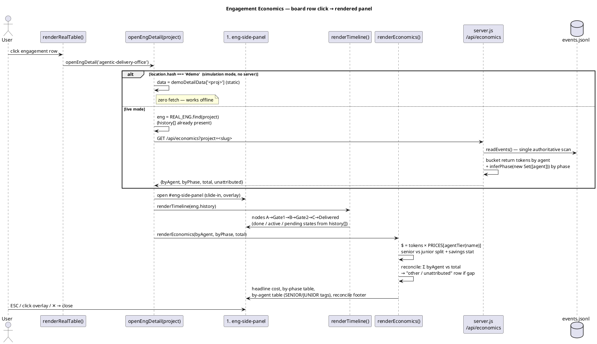

# High-Level Design — Engagement Economics

**Feature:** Engagement Economics — a drill-down panel in the Live Board cockpit
**Status:** Gate 1 APPROVED · HLD for Gate 2 review
**Author:** hld-architect
**Date:** 2026-06-22
**Approved mockup:** `examples/gate1-engagement-economics/index.html`

---

## 1. Executive summary

Engagement Economics adds a per-engagement drill-down to the Live Board cockpit. Clicking
any engagement row slides in a right-hand panel with two sections: (1) a **gate/phase
timeline** (A → Gate 1 → B → Gate 2 → C → Delivered) rendered from a new ordered
`history[]` of transitions, and (2) a **token→$ cost breakdown by phase and by agent**,
surfacing the senior-vs-junior tier split and the savings versus all-senior routing.

The work spans three files already in the approved component diagram: `server.js` gains a
new `/api/economics?project=` route that re-scans `events.jsonl` once and buckets per-
`return`-event tokens by agent and by phase (one authoritative scan → reconciliation to the
aggregate `/api/engagements` already returns); `office-state.sh` is changed to **append** a
`history[]` instead of overwriting state, so a real timeline exists; and the cockpit
`index.html` gets a new `#eng-side-panel` (a separate element from the Team view's
`.side-panel`), a per-row `openEngDetail(project)` click, `renderTimeline()`,
`renderEconomics()`, a hardcoded `PRICES` const, an `agentTier()` derived from the existing
client-side `LB_AGENTS[].bench` map, and `demoDetailData` so the panel works in `#demo` mode
with zero fetch.

Hard constraints are honored: **zero new runtime dependencies, no build step** (vanilla Node
`http`+SSE, single-file `index.html`), and the panel **works in `#demo` simulation mode with
no server**. All numbers reconcile honestly — when Σ agent tokens ≠ the board aggregate, an
explicit "other / unattributed" bucket is shown rather than silently absorbing the gap.

---

## 2. Goals & non-goals

### Goals
- Per-engagement right side-panel showing gate/phase timeline + cost breakdown, matching the
  approved mockup pixel-for-intent (board row → panel; timeline then economics; by-phase
  table, by-agent table with SENIOR/JUNIOR tags; headline savings stat; reconciliation footer).
- A **real** timeline: `office-state.sh` records an ordered history of transitions.
- A **single authoritative** server-side token scan so by-agent + by-phase sums reconcile to
  the aggregate `tokens` already surfaced by `/api/engagements`.
- Make the cost of junior-vs-senior routing visible and defensible at every gate review.
- Full operation in `#demo` mode with no server and zero network calls.

### Non-goals (this MVP)
- Editable prices in the Settings tier panel (hardening backlog — see §10).
- Historical per-token time-series charts / sparklines.
- Cross-engagement cost analytics or org-wide rollups (the Analytics view already exists for
  agent-level token bars; Economics is per-engagement).
- Server-side currency/locale handling; prices and `$` formatting are client-side.
- Changing how tokens are recorded in `events.jsonl` (we only read existing `return` events).
- Persisting prices, exchange rates, or per-model pricing tables server-side.

---

## 3. Component architecture

NEW = added by this feature · CHANGED = existing file modified · existing = untouched
dependency.

```plantuml
@startuml component
title Engagement Economics — Component Architecture

skinparam componentStyle rectangle
skinparam shadowing false

actor "CTO\n(cockpit user)" as User

package "Browser — .claude/board/index.html (CHANGED)" {
  [renderRealTable()\n(CHANGED: inject openEngDetail)] as RRT
  [openEngDetail(project)\n(NEW)] as OED
  [#eng-side-panel\n(NEW · separate from .side-panel)] as PANEL
  [renderTimeline()\n(NEW)] as RT
  [renderEconomics()\n(NEW)] as RE
  [PRICES const + agentTier()\n(NEW · derives tier from LB_AGENTS[].bench)] as PRICES
  [demoDetailData\n(NEW · static, zero-fetch)] as DEMO
  [LB_AGENTS[].bench\n(existing · senior/junior map)] as LBAG
  [rdTok / lbFmt\n(existing token formatters)] as FMT
}

package "Node server — .claude/board/server.js (CHANGED)" {
  [GET /api/economics?project=\n(NEW route)] as ECON
  [GET /api/engagements\n(existing · returns aggregate tokens)] as ENG
  [inferPhase(agents)\n(existing · reused by /api/economics)] as IP
  [readStates()\n(CHANGED: surface history[])] as RS
  [readEvents()\n(existing)] as REV
}

package "State on disk" {
  database "events.jsonl\n(existing · spawn/return events)" as EVENTS
  database "engagements/<proj>.json\n(CHANGED shape: + history[])" as PROJJSON
}

[office-state.sh\n(CHANGED: append history[])] as OSS

User --> RRT : click row
RRT --> OED : onclick="openEngDetail('<proj>')"
OED --> ENG : (already loaded) read history[] + aggregate
OED --> ECON : fetch /api/economics?project=
OED --> RT
OED --> RE
RT ..> LBAG : (none) reads history from /api/engagements
RE --> PRICES
PRICES ..> LBAG : agentTier(name)
RE --> FMT
OED --> DEMO : #demo → use static data, no fetch

ECON --> REV
ECON --> IP : bucket tokens by phase
ENG --> RS
RS --> PROJJSON : read history[]
REV --> EVENTS
ECON --> EVENTS

OSS --> PROJJSON : read-then-append transition
@enduml
```

**Notes on the wiring (faithful to the approved diagram):**
- `/api/economics` performs its **own** authoritative scan of `events.jsonl` and reuses the
  existing `inferPhase(agents)` to assign each `return` event's tokens to phase A/B/C. Because
  both `/api/engagements` and `/api/economics` read the same `events.jsonl`, the aggregate and
  the breakdown reconcile by construction (§7 covers the residual edge case).
- The timeline draws from `history[]`, which arrives via the **existing** `/api/engagements`
  payload (`readStates()` already merges `<proj>.json`; the change is that it now carries
  `history[]`). The panel therefore needs only one new fetch (`/api/economics`) plus data the
  cockpit already has in `REAL_ENG`.
- `#eng-side-panel` is a **new** DOM element copying the `.side-panel`/`.side-overlay` slide
  pattern (CSS ~902-916, JS `openSidePanel`/`closeSidePanel` ~2656-2678). It must NOT reuse the
  Team view's `.side-panel`/`sp-*` element, which is already bound to `TEAM_DEFS` via
  `openSidePanel()`.

---

## 4. Data design

### 4.1 New `history[]` record (one per `office-state.sh` call)

```jsonc
// history element — appended once per gate/phase transition
{
  "phase":  "A" | "B" | "C",                 // Concept | Design | Build
  "status": "gate1_pending" | "building" | "gate2_pending"
          | "escalated" | "delivered" | "active",   // same vocab as today's <status>
  "note":   "mockup + HL diagram ready for review", // free text, may be ""
  "ts":     1782119994                        // unix seconds (date +%s), append order
}
```

### 4.2 `engagements/<proj>.json` shape **after** the change

Top-level "current" fields are **retained verbatim** (so existing readers — `readStates()`,
`renderRealTable()` — keep working unchanged), and an ordered `history[]` is added:

```jsonc
{
  "project":   "agentic-delivery-office",
  "path":      "/Users/.../agentic-delivery-office",
  "phase":     "B",               // = last history[].phase  (current)
  "status":    "building",        // = last history[].status (current)
  "note":      "Engagement Economics: HLD in progress",
  "updatedAt": 1782119994,        // = last history[].ts     (current)
  "history": [                    // NEW — ordered oldest→newest
    { "phase":"A", "status":"gate1_pending", "note":"mockup ready",  "ts":1782000000 },
    { "phase":"B", "status":"building",      "note":"HLD in progress","ts":1782119994 }
  ]
}
```

Invariant: the top-level `phase`/`status`/`note`/`updatedAt` always equal the **last** element
of `history[]`. `office-state.sh` writes both atomically in one `jq` pass.

### 4.3 `/api/economics?project=<slug>` response

```jsonc
{
  "project":  "agentic-delivery-office",
  "byAgent":  {                    // agent-name → summed return-event tokens
    "planner":         32000,
    "explorer":        30000,
    "mockup-builder":  38000,
    "design-reviewer": 18000
  },
  "byPhase":  { "A": 118000, "B": 0, "C": 0 },  // inferPhase() buckets; always all three keys
  "total":    118000,             // Σ over all return events for this project
  "unattributed": 0               // total − Σ(byAgent of known agents); see §7. 0 in the happy path
}
```

- `total` is the same number `/api/engagements` reports as `tokens` for that project →
  guaranteed reconciliation target.
- `byPhase` always carries keys `A`,`B`,`C` (zero-filled) so the client renders a stable table.
- `unattributed` ≥ 0 is surfaced as the explicit "other / unattributed" bucket row (§7 / §6.4).
- Unknown project (no events, not enrolled) → `{project, byAgent:{}, byPhase:{A:0,B:0,C:0},
  total:0, unattributed:0}` with HTTP 200 (the panel renders an empty-but-valid economics
  section rather than erroring).

### 4.4 Server bucketing logic (`/api/economics`)

For the requested `project`, iterate `readEvents()`; for each `e.ev === 'return'` belonging to
that project:
1. `byAgent[e.agent] += (e.tokens || 0)`; `total += (e.tokens || 0)`.
2. Determine the event's phase. To reuse the existing `inferPhase(agents)` contract
   (agent-name→phase via the `PHASE_C`/`PHASE_B` sets), pass the **single** agent as a set:
   `inferPhase(new Set([e.agent]))`, then `byPhase[phase] += tokens`. This keeps one source of
   truth for the name→phase mapping; no second map is introduced.
3. After the loop, `unattributed = total − Σ(byAgent values whose agent is in the client tier
   map)` is computed **client-side** (the server returns full `byAgent` + `total`; the client
   knows the tier map). The server may additionally return `unattributed` as a convenience
   using a server-side knowledge of `inferPhase` membership; the authoritative honesty check is
   client-side in `renderEconomics()` because the tier map lives there.

> Elaboration: the server returns raw `byAgent`/`byPhase`/`total`; **dollars are never computed
> server-side** (prices live client-side, constraint-friendly and keeps the server pure-data).

---

## 5. Sequence diagram — primary flow (board row click → panel)



---

## 6. Pre-resolved design decisions (rationale)

These are **elaborations** of the approved concept, not deviations.

### 6.1 `history[]` granularity — one record per transition
One `{phase,status,note,ts}` is appended per `office-state.sh` invocation, i.e. per gate/phase
transition. Timeline nodes derive from this ordered list.
**Rationale:** matches the existing call sites exactly (the orchestrator already calls
`office-state.sh` once at each transition — A start, Gate 1 pending, B start, Gate 2 pending,
delivered, etc.), so the history is a faithful, no-extra-instrumentation log. Finer granularity
(per-agent-run) would duplicate what `events.jsonl` already records and is unnecessary for the
timeline.

### 6.2 Backward-compat / backfill — seed-on-first-append
Existing `<proj>.json` files have no `history[]`. On the **first** append after this change,
`office-state.sh` reads the existing file, synthesizes a seed history entry from the current
`{phase,status,note,updatedAt}`, then appends the new transition. No data loss; pre-existing
engagements show "current state + onward".
**Rationale:** zero migration script, zero downtime; the seed preserves the one transition we
already knew about. See §8 for the exact algorithm.

### 6.3 Prices location — hardcoded `PRICES` const in `index.html`
`PRICES = { SENIOR: 15, JUNIOR: 3 }` ($/Mtok, illustrative list prices relative to frontier),
defined once in the cockpit script alongside `LB_AGENTS`.
**Rationale:** honors "zero new runtime deps, no build step" — no config file, no server price
table, no env plumbing. Making prices editable in the existing Settings tier panel is a
hardening-backlog item (§10), not MVP. Prices are explicitly labeled "illustrative list prices"
in the panel footnote (matching the mockup) to avoid implying billing-grade accuracy.

### 6.4 Reconciliation mismatch — explicit "other / unattributed" bucket
When Σ byAgent tokens ≠ the aggregate `total` (e.g. a `return` event's agent name is absent
from the client tier map), `renderEconomics()` shows an explicit **"other / unattributed"**
row carrying the residual tokens (and its $ at a documented default tier — junior, the
conservative/cheaper assumption, clearly labeled), rather than silently absorbing the gap.
**Rationale:** honesty principle. A visible bucket makes a mapping gap obvious at the next gate
review instead of quietly distorting the senior/junior split. MVP includes the bucket; the
reconcile footer shows ✓ only when `unattributed === 0`, otherwise it shows the residual.

---

## 7. Cost / pricing model

### Inputs
- `byAgent: {name → tokens}` and `total` from `/api/economics` (live) or `demoDetailData`
  (`#demo`).
- `agentTier(name)` → `'SENIOR' | 'JUNIOR'`, derived from the existing client-side
  `LB_AGENTS[].bench` map. Senior bench: `planner, code-reviewer, security-reviewer, refuter,
  hld-architect, deck-architect`. Junior bench: `explorer, mockup-builder, test-writer,
  db-reviewer, design-reviewer, business-reviewer`. (Verified in `index.html` ~2230-2243.)
- `PRICES = { SENIOR: 15, JUNIOR: 3 }` — $/1,000,000 tokens, illustrative.

### Formulas
```
costOf(name)      = tokens(name) / 1_000_000 × PRICES[agentTier(name)]
phaseCost(P)      = Σ over agents-in-P  costOf(name)         // derived; or byPhase tokens × blended rate
actualTotalCost   = Σ over all agents   costOf(name)
juniorTokens      = Σ tokens where tier == JUNIOR
juniorPct         = round(100 × juniorTokens / total)
allSeniorCost     = total / 1_000_000 × PRICES.SENIOR        // counterfactual: everything at senior rate
savedAmt          = allSeniorCost − actualTotalCost
savedPct          = round(100 × savedAmt / allSeniorCost)
```

### Reconciliation
```
attributed   = Σ tokens for agents present in the tier map
unattributed = total − attributed                  // ≥ 0
```
- `unattributed === 0` → reconcile footer shows `✓ Σ agent tokens = <total> = board total`.
- `unattributed > 0` → render an "other / unattributed" by-agent row with `unattributed` tokens
  (tier label `—`, costed at JUNIOR rate, flagged), and the footer shows the residual instead
  of ✓.

### Display
Tokens use the existing `rdTok`/`lbFmt` helpers ("118k tk", "32k"). Costs render as `$X.XX`,
always in amber (`--cyan`/`--amber`/`--success` token discipline from the mockup; tokens/costs
always amber, phase A=cyan/B=amber/C=success). The headline savings stat mirrors the mockup:
"Junior tier ran **N%** of tokens at ~1/5 the price → saved **$X.XX** (**P%**) vs all-senior
routing." Footnote: "Illustrative list prices: SENIOR $15/1M tk · JUNIOR $3/1M tk (~1/5)."

---

## 8. Backward-compatibility & migration

No schema migration tool ships. Migration is **lazy, on first write**, inside `office-state.sh`:

```sh
# office-state.sh — append-with-seed algorithm (replaces the single-object overwrite)
file="$dir/$slug.json"
new_entry=$(jq -cn --arg ph "$phase" --arg st "$status" --arg n "$note" --argjson ts "$ts" \
              '{phase:$ph,status:$st,note:$n,ts:$ts}')

if [ -f "$file" ]; then
  # read existing; seed history[] from current top-level fields if absent, then append
  jq -c --argjson e "$new_entry" '
    ( if (.history|type) == "array" then .history else
        [ { phase:.phase, status:.status, note:(.note//""), ts:(.updatedAt//0) } ]
      end ) as $h
    | { project, path,
        phase:  $e.phase, status: $e.status, note: $e.note, updatedAt: $e.ts,
        history: ($h + [$e]) }
  ' "$file" > "$file.tmp" && mv "$file.tmp" "$file"
else
  # first ever record for this project: history = [seed == the entry itself]
  jq -cn --arg p "$slug" --arg pp "$proj" --argjson e "$new_entry" \
    '{project:$p, path:$pp, phase:$e.phase, status:$e.status,
      note:$e.note, updatedAt:$e.ts, history:[$e]}' > "$file"
fi
```

**Compatibility guarantees:**
- Top-level `{project,path,phase,status,note,updatedAt}` are preserved exactly → `readStates()`
  and `renderRealTable()` need no change to keep working.
- `readStates()` (server) gains a one-line passthrough so `history` flows into
  `/api/engagements` (`out[s.project] = s` already copies the whole object; the only change is
  ensuring `engagements()` carries `history` onto each list item — see §3 wiring).
- The `cleared` path (`rm -f`) is unchanged.
- A pre-change `<proj>.json` read by the new cockpit before any new transition has no
  `history[]`; `renderTimeline()` must tolerate a missing/empty `history` by falling back to a
  single derived node from the top-level current state (defensive; same data the seed would
  synthesize).
- Writes are atomic (`.tmp` + `mv`) to avoid a torn file if read concurrently by the server.

---

## 9. Acceptance criteria (testable)

1. **Route exists & reconciles.** `GET /api/economics?project=<enrolled-slug>` returns
   `{project,byAgent,byPhase,total,unattributed}`; `total` equals the `tokens` value
   `/api/engagements` reports for the same project (byte-for-byte same integer).
2. **Phase bucketing.** For a fixture `events.jsonl`, Σ `byPhase` values === `total`, and each
   `return` event's tokens land in the phase `inferPhase(new Set([agent]))` returns.
3. **byAgent correctness.** For the fixture, `byAgent[name]` === Σ of that agent's `return`
   `tokens`; agents with only `spawn` events contribute 0.
4. **Unknown project.** `GET /api/economics?project=does-not-exist` → HTTP 200,
   `{byAgent:{},byPhase:{A:0,B:0,C:0},total:0,unattributed:0}`.
5. **history append.** Two successive `office-state.sh A gate1_pending "x"` /
   `office-state.sh B building "y"` calls yield a `<proj>.json` whose `history` has 2 ordered
   elements and whose top-level fields equal the last element.
6. **Backfill seed.** Given a pre-change `<proj>.json` (no `history`), one `office-state.sh`
   call produces `history` of length 2: `[seed-from-old-state, new-entry]`, no field lost.
7. **Panel opens per-engagement.** Clicking a `renderRealTable()` row calls
   `openEngDetail('<that row's project>')` (not the generic board onclick) and opens
   `#eng-side-panel`, NOT the Team `.side-panel` (verified by element id).
8. **Timeline renders from history.** `renderTimeline()` draws one node per `history[]` entry
   in order, with done/active/pending styling, plus the canonical A→Gate1→B→Gate2→C→Delivered
   scaffold; nodes show note + timestamp.
9. **Economics renders & costs.** `renderEconomics()` shows by-phase and by-agent tables;
   each agent row carries a SENIOR/JUNIOR tag matching `agentTier(name)`; cost === tokens/1e6 ×
   `PRICES[tier]`; headline shows juniorPct + savedAmt + savedPct per §7 formulas.
10. **Reconcile honesty.** With a fixture containing an agent name absent from the tier map, an
    "other / unattributed" row appears with the residual tokens and the footer shows the gap
    (no ✓); with a clean fixture the footer shows ✓ and `unattributed===0`.
11. **#demo works offline.** With `location.hash === '#demo'`, clicking a row opens the panel
    fully populated from `demoDetailData` with **zero** network requests (verifiable: no
    `/api/economics` call fires), matching the static shape the endpoint returns.
12. **No new deps / no build.** `server.js` still requires only `http`/`fs`/`path`;
    `index.html` remains a single file with no build step; `node .claude/board/server.js` boots
    and serves the panel.
13. **Visual parity.** The rendered panel matches `examples/gate1-engagement-economics/
    index.html`: timeline section then economics section, by-phase table, by-agent table with
    tier tags, headline savings tile, reconcile footer, illustrative-price footnote; design
    tokens and phase colors (A=cyan, B=amber, C=success; tokens/costs amber) preserved.

---

## 10. Build split

### MVP slice — first working end-to-end path (in dependency order)
1. **`office-state.sh`** — append-with-seed `history[]` (§8). *Unblocks real timeline data.*
2. **`server.js`** — (a) `engagements()` carries `history` onto each list item; (b) new
   `/api/economics?project=` route doing the single authoritative scan + `inferPhase` bucketing
   (§3.4, §4.3). *Provides both data sources.*
3. **`index.html` — data + tier:** `PRICES` const, `agentTier()` from `LB_AGENTS[].bench`,
   `demoDetailData` (static, mockup-shaped).
4. **`index.html` — panel shell:** copy `.side-panel`/`.side-overlay` pattern into a new
   `#eng-side-panel` + `openEngDetail(project)` + close/ESC; inject
   `onclick="openEngDetail('${e.project}')"` into the `renderRealTable()` row (~2012-2020),
   replacing/augmenting the generic board onclick so each row carries its identity.
5. **`index.html` — render:** `renderTimeline(history)` and `renderEconomics(byAgent,byPhase,
   total)` incl. savings stat + reconcile bucket; `#demo` branch uses `demoDetailData` with no
   fetch.

This sequence yields a clickable, reconciling, demo-safe panel — the acceptance-criteria
happy path end to end.

### Hardening backlog (post-MVP)
- Editable prices in the Settings tier panel (persist to a small client store; surface a
  "prices are illustrative / your list" control). *Decision 6.3 deferred item.*
- Per-model pricing (more than two tiers) and a configurable tier→price table.
- Cost time-series / sparkline per engagement; cross-engagement rollup view.
- Server-side memoization of the economics scan (cache by `events.jsonl` size+mtime) if the
  log grows large enough that the per-click rescan is noticeable.
- Richer timeline: duration deltas between transitions, agent attribution per gate.
- Export (CSV/JSON) of an engagement's economics for finance.
- Surface `unattributed` as a board-level health signal (e.g. a roster gap warning) when it is
  persistently > 0.

---

## 11. Deviations from approved concept

**None — elaborations only.** Every component, route, and UI element in this HLD is present in
the Gate 1 component diagram and the approved mockup. The following are explicit elaborations
(decisions filled in within the approved shape), not departures:

- **E1 — history[] granularity (Decision 6.1):** one `{phase,status,note,ts}` appended per
  `office-state.sh` call. Elaborates the approved "APPEND a `history[]` of transitions" — fixes
  the record granularity to match existing call sites.
- **E2 — backfill via seed-on-first-append (Decision 6.2):** existing `<proj>.json` files get a
  synthesized seed entry on first append. Elaborates the approved append change with a concrete,
  lossless, no-migration backward-compat path.
- **E3 — PRICES hardcoded in index.html (Decision 6.3):** `{SENIOR:15, JUNIOR:3}` $/Mtok,
  labeled illustrative. Elaborates the approved "NEW `PRICES` const"; editable-in-Settings is
  deferred to the hardening backlog (§10), not silently dropped.
- **E4 — explicit "other / unattributed" bucket (Decision 6.4):** mismatches between Σ byAgent
  and the aggregate render a visible residual row rather than being absorbed. Elaborates the
  approved reconciliation guarantee with an honesty rule; MVP includes the bucket.
- **E5 — phase bucketing reuses `inferPhase` via single-agent set:**
  `inferPhase(new Set([e.agent]))` per `return` event. Elaborates the approved "reuse existing
  `inferPhase(agents)`" by fixing the exact call shape so no second name→phase map is
  introduced — one source of truth.
- **E6 — dollars computed client-side only:** `/api/economics` returns raw tokens
  (`byAgent`/`byPhase`/`total`); all `$` math uses the client `PRICES`. Elaborates the split
  implied by "NEW `PRICES` const … in index.html" — keeps the server pure-data and honors the
  zero-new-dependency constraint.
- **E7 — timeline data path:** `history[]` reaches the client through the existing
  `/api/engagements` payload (via `readStates()`), so the panel adds exactly one new fetch
  (`/api/economics`). Elaborates "`server.js readStates()` surfaces `history[]` through
  `/api/engagements`" with the concrete data flow.

No element of the approved component diagram or mockup is removed, replaced, or reshaped.

---

## 12. Risks

| # | Risk | Likelihood | Impact | Mitigation |
|---|------|-----------|--------|------------|
| R1 | **Phase attribution drift** — `inferPhase` keys on agent identity, but a junior agent (e.g. `business-reviewer`) runs in multiple phases, so per-event phase may not match the engagement's real gate. | Med | Med | Documented as an approximation; `byPhase` is a heuristic bucket, `byAgent` is exact. Hardening: attribute phase from the surrounding `history[]` timestamp window rather than agent name. |
| R2 | **Reconciliation gap** — a `return` event with an agent name absent from `LB_AGENTS` tier map. | Med | Low | Decision 6.4 — explicit "other / unattributed" bucket; footer shows residual; never silently absorbed. |
| R3 | **Per-click rescan cost** — `/api/economics` re-reads all of `events.jsonl` on each open; grows with log size. | Low (now) | Low | Acceptable at current scale (log is small; one project's events). Hardening backlog: memoize by file size+mtime. |
| R4 | **Element collision** — accidentally reusing the Team view's `.side-panel`/`sp-*` would break the bound Team flow. | Low | High | Mandate a **separate** `#eng-side-panel` (Decision in approved diagram); acceptance criterion #7 asserts the element id. |
| R5 | **Demo/live shape drift** — `demoDetailData` diverges from the real `/api/economics` shape. | Med | Med | `demoDetailData` is authored to the exact §4.3 schema; acceptance #11 asserts same-shape; a shared render path (one `renderEconomics`) consumes both. |
| R6 | **Torn write** — server reads `<proj>.json` mid-append. | Low | Low | Atomic `.tmp`+`mv` in `office-state.sh` (§8); `readStates()` already wraps parse in try/catch. |
| R7 | **Price misinterpretation** — illustrative prices read as billing. | Med | Low | Footnote labels them illustrative list prices (mockup-faithful); editable real prices are an explicit backlog item. |
| R8 | **Two board copies** — canonical `.claude/board/` and the `~/.claude/office-board/` mirror are byte-identical today; edits to one must be mirrored. | Med | Med | Build step ships changes to **both** copies (or a single source with a sync); verified identical at design time, so a one-time mirror is sufficient. |

---

*End of HLD.*
